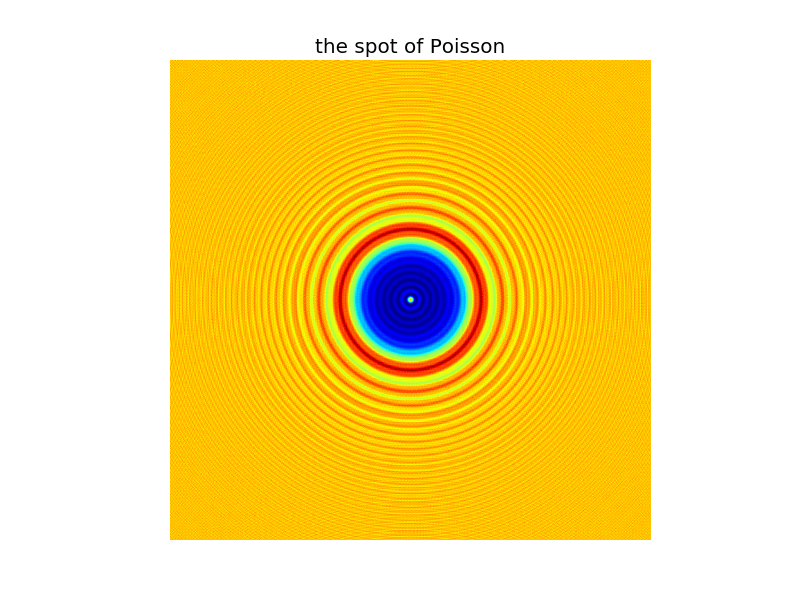

.. _Poisson:

.. Index::
    Poisson spot
    Arago spot
    Diffraction
    Forvard
    CircScreen
    Begin
    Intensity

----------------
Spot of Poisson.
----------------

:download:`Download Python script <./examples/Poisson.py.txt>` [#f1]_

.. code-block:: python

    #spot of Poisson
    import LightPipes
    import matplotlib.pyplot as plt
    m=1
    nm=1e-9*m
    um=1e-6*m
    mm=1e-3*m
    cm=1e-2*m
    pi=3.1415
    try:
        LP=LightPipes.Init()
        wavelength=500*nm
        size=10*mm
        N=1500
        w=1*mm
        z=1*m
        F=LP.Begin(size,wavelength,N)
        F=LP.CircScreen(w,0,0,F)
        F=LP.Forvard(z,F)
        I=LP.Intensity(2,F)
        plt.imshow(I)
        plt.title('the spot of Poisson')
        plt.axis('off')
        plt.show()
    finally:
        del LightPipes
        

    
    Intensity pattern at 1 m behind the disk. Spot of Poisson or Arago.

.. rubric:: Footnotes

.. [#f1] ´.txt´ has been added to the file name to avoid download problems. Remove ´.txt´ before running the script.
