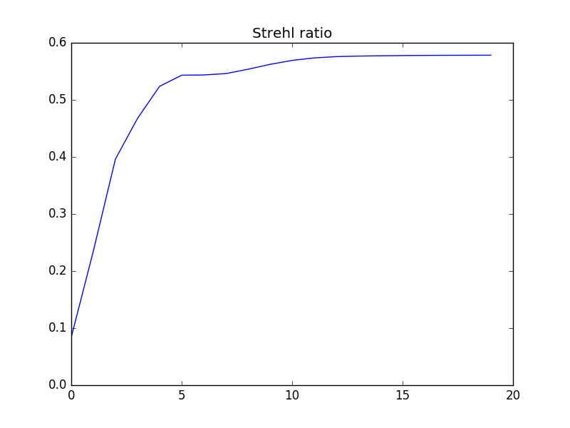

.. _Unstab:

.. Index::
    Unstable resonator
    RandomIntensity
    RandomPhase
    RectAperture
    RectScreen
    Gain
    LensFresnel
    Tilt
    Strehl
    Interpol
    Fresnel
    CircAperture
    Begin
    Intensity
    Convert
    Lens
    Laser

-------------------
Unstable resonator.
-------------------

:download:`Download Python script <./examples/Unstab.py.txt>` [#f1]_

.. code-block:: python

    #Unstable resonator.
    import LightPipes
    from mpl_toolkits.mplot3d import Axes3D
    import matplotlib.pyplot as plt
    import numpy as np
    import time
    
    m=1
    nm=1e-9*m
    um=1e-6*m
    mm=1e-3*m
    
    LP=LightPipes.Init()
    
    wavelength = 308*nm
    size=14*mm
    N=100
    w=5.48*mm
    f1=-10*m; f2=20*m; L=10*m; Isat=1.0; alpha=1e-4; Lgain=1e4;
    tx=0.0; ty=0.00000;
    Nrndtrips=20
    X=np.zeros(N)
    Y=np.zeros(N)
    SR=np.zeros(Nrndtrips+1)
    F=LP.Begin(size,wavelength,N);
    F=LP.RandomIntensity(time.time(),1000,F)
    F=LP.RandomPhase(time.time(),10,F);
    
    for k in range(1,Nrndtrips+1):
        F=LP.RectAperture(w,w,0,0,0,F);   F=LP.Gain(Isat,alpha,Lgain,F);
        F=LP.LensFresnel(f1,L,F);   F=LP.Gain(Isat,alpha,Lgain,F);
        F=LP.LensFresnel(f2,L,F);
        F=LP.Tilt(tx,ty,F);
        SR[k]=LP.Strehl(F);
        F=LP.Interpol(size,N,0,0,0,1,F);
        print ('Round trip ',k,' Strehl ratio= ',SR[k],'\n');
        F2=LP.RectScreen(w,w,0,0,0,F);
        I=LP.Intensity(2,F2);
        plt.subplot(2,Nrndtrips/2,k)
        plt.title(k)
        plt.axis('off')
        plt.imshow(I)
    F2=LP.Convert(F2);
    i=range(N)
    j=i
    X, Y=np.meshgrid(i,j)
    fig = plt.figure()
    ax = fig.gca(projection='3d')
    surf = ax.plot_surface(X, Y, I, rstride=2, cstride=2, cmap='rainbow', linewidth=0.0)
    plt.axis('off')
    
    fig = plt.figure()
    x=np.arange(1,1,Nrndtrips+1);
    plt.plot(SR[1:Nrndtrips+1])
    plt.title('Strehl ratio')
    
    #Far-field calculation:
    z=1*m; f=40*m;
    ff=z*f/(f-z);
    F2=LP.Lens(f,0,0,F2);
    F2=LP.LensFresnel(ff,z,F2);
    F2=LP.Convert(F2);
    I2=LP.Intensity(1,F2);
    fig = plt.figure()
    ax = fig.gca(projection='3d')
    surf = ax.plot_surface(X, Y, I2, rstride=1, cstride=1, cmap='rainbow', linewidth=0.0)
    plt.axis('off')
    
    plt.show() 
    del LightPipes

.. figure:: figures/Unstab_1.png
    :align:   center
    
    Evolution of the intensity pattern just after the outcoupler.

.. figure:: figures/Unstab_2.png
    :align:   center
    
    Intensity pattern after 20 roundtrips.

    
    Evolution of the Strehl ratio.

.. figure:: figures/Unstab_4.png
    :align:   center
    
    Far field intensity pattern.
    
    
    
    
.. rubric:: Footnotes

.. [#f1] ´.txt´ has been added to the file name to avoid download problems. Remove ´.txt´ before running the script.
