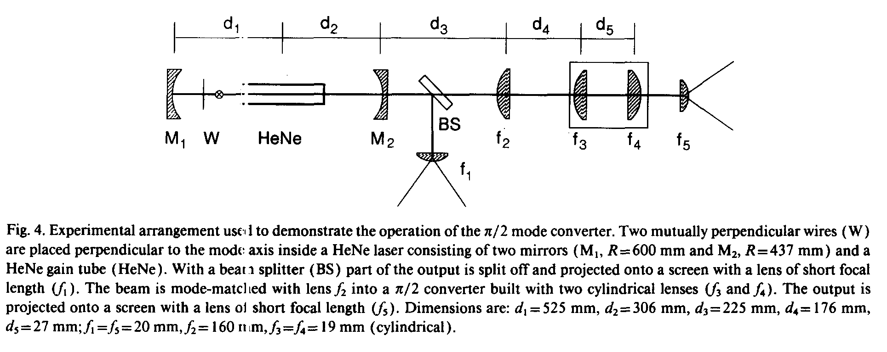

Transformation of high order Gauss modes.
-----------------------------------------

From Hermite to Laguerre.
^^^^^^^^^^^^^^^^^^^^^^^^^

Beside the application of a spiral phase plate, it is also possible to transform Hermite Gauss  into Laguerre Gauss laser modes with the help of a pair of cylindrical lenses. This so-called 'astigmatic laser mode converter' has been introduced by M.W. Beijersbergen et al. [#f1]_.  We used their experimental setup to demonstrate this in the Python script below [#f2]_ [#f3]_ .

    
    *M.W. Beijersbergen, L. Allen, H.E.L.O. van der Veen and J.P. Woerdman, Astigmatic laser mode converters and transfer of orbital angular momentum, Optics Comm. 96 (1993) 123.*

.. plot:: ./Examples/Laser/LaserModeTransformer.py

.. figure::  _static/LaserModeTransformer1.png
    :align:   center
    
    Conversion of a Hermite 3,3 mode
    
.. figure::  _static/LaserModeTransformer2.png
    :align:   center
    
    Conversion of a Hermite 1,3 mode

From Laguerre to Hermite.
^^^^^^^^^^^^^^^^^^^^^^^^^

The transformation from a Laguerre to a Hermite mode is also possible with this setup:

.. figure::  _static/LaserModeTransformer3.png
    :align:   center
    
    Conversion of a Laguerre 0,4 to a Hermite Gauss 4,4 mode
    
.. figure::  _static/LaserModeTransformer4.png
    :align:   center
    
    Conversion of a Laguerre 0,1 to a Hermite Gauss 1,1 mode

.. rubric:: References:

.. [#f1] M.W. Beijersbergen, L. Allen, H.E.L.O. van der Veen and J.P. Woerdman, Astigmatic laser mode converters and transfer of orbital angular momentum, Optics Comm. 96 (1993) 123.

.. rubric:: Remarks:

.. [#f2] We had to change some of the parameters used in the experiment slightly (d3, d4 and f2) to get a better mode matching.

.. [#f3] The size of the Gauss beam in the resonator in its waist was calculated in the usual way. The effect of the outcoupler, which acts as a negative lens, was taken into account as well in the simulation. 
