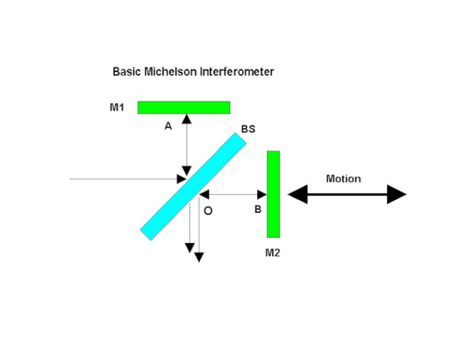

Michelson interferometer.
-------------------------

In a Michelson interferometer an incoming wave is split in two by a beamsplitter. The two beams are reflected by mirrors and united at the same beamsplitter, which generally results in interference. The interference pattern observed depends on the incoming beam, whether or not the mirrors are tilted and on the difference of the distances of the mirrors to the beamsplitter.

In this experiment we demonstrate a Michelson interferometer with unequal mirror distances and one of the mirrors tilted.

.. code-block:: python

    #! /usr/bin/env python
    from LightPipes import *
    import matplotlib.pyplot as plt

    wavelength=632.8*nm #wavelength of HeNe laser
    size=15*mm # size of the grid
    N=500 # number (NxN) of grid pixels
    R=9*mm # laser beam radius
    z1=8*cm # length of arm 1
    z2=7*cm # length of arm 2
    z3=3*cm # distance laser to beamsplitter
    z4=5*cm # distance beamsplitter to screen
    Rbs=0.5 # reflection beam splitter
    tx=0.5*mrad; ty=0.0*mrad # tilt of mirror 1

    #Generate a laser beam:
    F=Begin(size,wavelength,N)
    F=GaussBeam(F, R)

    #Propagate to the beamsplitter:
    F=Forvard(F,z3)

    #Split the beam and propagate to mirror #2:
    F2=IntAttenuator(F, 1-Rbs)
    F2=Forvard(F2,z2)

    #Introduce aberration and propagate back to the beamsplitter:
    F2=Tilt(F2,tx,ty)
    F2=Forvard(F2,z2)
    F2=IntAttenuator(F2,Rbs)

    #Split off the second beam and propagate to- and back from the mirror #1:
    F10=IntAttenuator(F,Rbs)
    F1=Forvard(F10,z1*2)
    F1=IntAttenuator(F1,1-Rbs)

    #Recombine the two beams and propagate to the screen:
    F=BeamMix(F1,F2)
    F=Forvard(F,z4)
    I=Intensity(F)

    #Present the results:
    s1 =    r'LightPipes for Python ' + LPversion + '\n\n'\
            r'Michelson interferometer with mirror tilt in one arm' + '\n'
    s2 =    r'Michelson.py'+ '\n\n'\
            f'size = {size/mm:4.2f} mm' + '\n'\
            f'$\\lambda$ = {wavelength/um:4.2f} $\\mu$m' + '\n'\
            f'N = {N:d}' + '\n'\
            f'R = {R/mm:4.2f} mm beam radius of the laser' + '\n'\
            f'z1 = {z1/mm:4.2f} mm length of arm 1' + '\n'\
            f'z2 = {z2/mm:4.2f} mm length of arm 2' + '\n'\
            f'z3 = {z3/mm:4.2f} mm distance from the laser to the beam splitter' + '\n'\
            f'z4 = {z4/mm:4.2f} mm distance from the beam splitter to the screen' + '\n'\
            f'tx, ty = {tx/mrad:4.2f}, {ty/mrad:4.2f} mrad tilt of mirror 2' + '\n\n'\
            r'${\copyright}$ Fred van Goor, June 2020'
            
    fig=plt.figure(figsize=(6,9));
    ax1 = fig.add_subplot(311);ax1.axis('off')
    ax2 = fig.add_subplot(312);ax2.axis('off')
    ax3 = fig.add_subplot(313);ax3.axis('off')
    ax1.imshow(I,cmap='jet');ax1.set_title('intensity pattern')
    ax2.text(0.0,0.6,s1,fontsize=12, fontweight='bold')
    ax3.text(0.0,0.50,s2)

    plt.show()

.. Index::
    Michelson
    interferometer
    GaussHermite
    Lens
    IntAttenuator
    Tilt
    BeamMix
    Forvard
    Begin
    Intensity

.. plot:: ./Examples/Interference/Michelson.py

----

You can modify the source Python script by, for example, insertion of a lens in one of the arms and remove the mirror tilt. The resulting interference pattern will be a set of concentric circles.

.. code-block:: python

    #! /usr/bin/env python
    from LightPipes import *
    import matplotlib.pyplot as plt

    wavelength=632.8*nm #wavelength of HeNe laser
    size=15*mm # size of the grid
    N=500 # number (NxN) of grid pixels
    R=9*mm # laser beam radius
    z1=8*cm # length of arm 1
    z2=7*cm # length of arm 2
    z3=3*cm # distance laser to beamsplitter
    z4=5*cm # distance beamsplitter to screen
    Rbs=0.5 # reflection beam splitter
    tx=0.0*mrad; ty=0.0*mrad # tilt of mirror 1
    f_lens = 500*cm

    #Generate a laser beam:
    F=Begin(size,wavelength,N)
    F=GaussBeam(F, R)

    #Propagate to the beamsplitter:
    F=Forvard(z3,F)

    #Split the beam and propagate to mirror #2:
    F2=IntAttenuator(1-Rbs,F)
    F2=Forvard(z2,F2)

    #Introduce aberration and propagate back to the beamsplitter:
    F2=Tilt(tx,ty,F2)
    F2 = Lens(f_lens, F2)
    F2=Forvard(z2,F2)
    F2=IntAttenuator(Rbs,F2)

    #Split off the second beam and propagate to- and back from the mirror #1:
    F10=IntAttenuator(Rbs,F)
    F1=Forvard(z1*2,F10)
    F1=IntAttenuator(1-Rbs,F1)

    #Recombine the two beams and propagate to the screen:
    F=BeamMix(F1,F2)
    F=Forvard(z4,F)
    I=Intensity(1,F)

    s1 =    r'LightPipes for Python ' + LPversion + '\n\n'\
            r'Michelson interferometer with a lens in one arm' + '\n'
    s2 =    r'Michelson.py'+ '\n\n'\
            f'size = {size/mm:4.2f} mm' + '\n'\
            f'$\\lambda$ = {wavelength/um:4.2f} $\\mu$m' + '\n'\
            f'N = {N:d}' + '\n'\
            f'R = {R/mm:4.2f} mm beam radius of the laser' + '\n'\
            f'z1 = {z1/mm:4.2f} mm length of arm 1' + '\n'\
            f'z2 = {z2/mm:4.2f} mm length of arm 2' + '\n'\
            f'z3 = {z3/mm:4.2f} mm distance from the laser to the beam splitter' + '\n'\
            f'z4 = {z4/mm:4.2f} mm distance from the beam splitter to the screen' + '\n'\
            f'tx, ty = {tx/mrad:4.2f}, {ty/mrad:4.2f} mrad tilt of mirror 2' + '\n'\
            r'$f_{lens}$ = ' + f'{f_lens/cm:4.2f} cm focal length of the lens in arm 2' + '\n\n'\
            r'${\copyright}$ Fred van Goor, June 2020'
            
    fig=plt.figure(figsize=(6,9));
    ax1 = fig.add_subplot(311);ax1.axis('off')
    ax2 = fig.add_subplot(312);ax2.axis('off')
    ax3 = fig.add_subplot(313);ax3.axis('off')
    ax1.imshow(I,cmap='jet');ax1.set_title('intensity pattern')
    ax2.text(0.0,0.6,s1,fontsize=12, fontweight='bold')
    ax3.text(0.0,0.50,s2)

    plt.show()

.. plot:: ./Examples/Interference/Michelson-with-lens.py

----

Also the Michelson interferometer can be used to study the effect of phase aberrations. Place a phase aberrator, for example a Zernike aberration, in one of the arms.

.. code-block:: python

    #! /usr/bin/env python
    from LightPipes import *
    import matplotlib.pyplot as plt

    wavelength=632.8*nm #wavelength of HeNe laser
    size=15*mm # size of the grid
    N=500 # number (NxN) of grid pixels
    R=9*mm # laser beam radius
    z1=8*cm # length of arm 1
    z2=7*cm # length of arm 2
    z3=3*cm # distance laser to beamsplitter
    z4=5*cm # distance beamsplitter to screen
    Rbs=0.5 # reflection beam splitter
    tx=0.0*mrad; ty=0.0*mrad # tilt of mirror 1
    zernabb = 7 # Zernike aberration (7 = vertical coma)

    #Generate a laser beam:
    F=Begin(size,wavelength,N)
    F=GaussBeam(F, R)

    #Propagate to the beamsplitter:
    F=Forvard(z3,F)

    #Split the beam and propagate to mirror #2:
    F2=IntAttenuator(1-Rbs,F)
    F2=Forvard(z2,F2)

    #Introduce aberration and propagate back to the beamsplitter:
    F2=Tilt(tx,ty,F2)
    (mz, nz) = noll_to_zern(zernabb)
    F2=Zernike(F2, mz, nz, 6*mm, A=1.03*wavelength)
    F2=Forvard(z2,F2)
    F2=IntAttenuator(Rbs,F2)

    #Split off the second beam and propagate to- and back from the mirror #1:
    F10=IntAttenuator(Rbs,F)
    F1=Forvard(z1*2,F10)
    F1=IntAttenuator(1-Rbs,F1)

    #Recombine the two beams and propagate to the screen:
    F=BeamMix(F1,F2)
    F=Forvard(z4,F)
    I=Intensity(1,F)

    s1 =    r'LightPipes for Python ' + LPversion + '\n\n'\
            r'Michelson interferometer with Zernike'+ '\n' + 'aberration in one arm' + '\n'
            
    s2 =    r'Michelson-with-aberration.py'+ '\n\n'\
            f'size = {size/mm:4.2f} mm' + '\n'\
            f'$\\lambda$ = {wavelength/um:4.2f} $\\mu$m' + '\n'\
            f'N = {N:d}' + '\n'\
            f'R = {R/mm:4.2f} mm beam radius of the laser' + '\n'\
            f'z1 = {z1/mm:4.2f} mm length of arm 1' + '\n'\
            f'z2 = {z2/mm:4.2f} mm length of arm 2' + '\n'\
            f'z3 = {z3/mm:4.2f} mm distance from the laser to the beam splitter' + '\n'\
            f'z4 = {z4/mm:4.2f} mm distance from the beam splitter to the screen' + '\n'\
            f'tx, ty = {tx/mrad:4.2f}, {ty/mrad:4.2f} mrad tilt of mirror 2' + '\n'\
            f'Zernike aberration = {noll_to_zern(zernabb)}, {ZernikeName(zernabb)}' + '\n\n'\
            r'${\copyright}$ Fred van Goor, June 2020'
            
    fig=plt.figure(figsize=(6,9));
    ax1 = fig.add_subplot(311);ax1.axis('off')
    ax2 = fig.add_subplot(312);ax2.axis('off')
    ax3 = fig.add_subplot(313);ax3.axis('off')
    ax1.imshow(I,cmap='jet');ax1.set_title('intensity pattern')
    ax2.text(0.0,0.6,s1,fontsize=12, fontweight='bold')
    ax3.text(0.0,0.50,s2)

    plt.show()

.. plot:: ./Examples/Interference/Michelson-with-aberration.py
