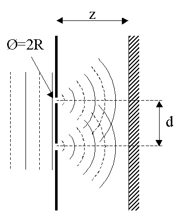

.. Index::
    Two holes interferometer
    Young's interferometer
    BeamMix
    Fresnel
    CircAperture
    Begin
    Intensity
    Young's experiment
    Double slit
    Interference
    Fresnel
    Begin
    Intensity
    RectAperture

Young’s Experiment
------------------

Young’s double–slit experiment is one of the most iconic demonstrations of the
wave nature of light. When a coherent beam illuminates two narrow, closely
spaced slits, the diffracted wavefronts emerging from the slits interfere and
produce a characteristic fringe pattern on a distant screen. The bright and dark
fringes arise from constructive and destructive interference of the two coherent
fields.

This example shows how to simulate Young’s experiment using LightPipes. It
demonstrates how diffraction from each slit combines to form the interference
pattern observed on the screen.

What this example illustrates
^^^^^^^^^^^^^^^^^^^^^^^^^^^^^

- Creation of a uniform plane wave.
- Definition of two rectangular slits with finite width and height.
- Coherent addition of the two slit fields using :math:`\mathrm{BeamMix}`.
- Fresnel propagation to the observation screen.
- Formation of interference fringes modulated by the single–slit diffraction envelope.

Physical background
^^^^^^^^^^^^^^^^^^^

Each slit acts as a secondary source of a diffracted wavefront. At any point on
the screen, the total field is the coherent sum of the contributions from both
slits. The relative phase between these contributions determines whether the
resulting intensity is bright (constructive interference) or dark (destructive
interference).

The approximate fringe spacing is given by:

.. math::

   \Delta x \approx \frac{\lambda z}{d}

where :math:`\lambda` is the wavelength, :math:`z` the propagation distance, and
:math:`d` the center–to–center separation between the slits. Increasing the slit
separation produces more closely spaced fringes, while increasing the
propagation distance enlarges the pattern.

Code example
^^^^^^^^^^^^

.. code-block:: python
   :linenos:

   import numpy as np
   from LightPipes import *
   import matplotlib.pyplot as plt

   # Parameters
   wavelength = 633 * nm
   size = 25 * mm
   N = 500
   z = 1.0 * m

   # Slit parameters
   slit_width = 0.10 * mm
   slit_height = 15 * mm
   slit_distance = 0.8 * mm   # center-to-center separation

   # Begin with a plane wave
   F = Begin(size, wavelength, N)

   # Two rectangular slits (offset in y-direction)
   F1 = RectAperture(F, slit_width, slit_height, 0, +slit_distance/2)
   F2 = RectAperture(F, slit_width, slit_height, 0, -slit_distance/2)

   # Coherent addition of the two slit fields
   F = BeamMix(F1, F2)

   # Fresnel propagation to the screen
   F = Fresnel(F, z)

   # Intensity at the screen
   I = Intensity(0, F)

   # Coordinates for plotting
   x = np.linspace(-size/2, size/2, N) / mm

   plt.figure(figsize=(6, 5))
   plt.imshow(I, extent=[x[0], x[-1], x[0], x[-1]], cmap='inferno')
   plt.xlabel('x (mm)')
   plt.ylabel('y (mm)')
   plt.title("Young's Double-Slit Interference at z = 1 m")
   plt.colorbar(label='Normalized intensity')
   plt.show()

Expected result
^^^^^^^^^^^^^^^

The intensity distribution on the screen shows:

- A series of bright and dark vertical fringes due to interference between the
  two coherent slit fields.
- A slowly varying envelope caused by single–slit diffraction.
- Fringe spacing that increases with propagation distance and decreases with
  slit separation.

At shorter propagation distances, the pattern exhibits a mixture of diffraction
and interference. At larger distances, the classical double–slit interference
fringes become more clearly defined.

.. plot:: ./Examples/Interference/TwoSlits.py

Two holes in stead of two slits
^^^^^^^^^^^^^^^^^^^^^^^^^^^^^^^

The following python script simulates the interference from two small holes:
 
.. code-block:: python

    from LightPipes import *
    import matplotlib.pyplot as plt
    """
        Young's experiment.
        Two holes with radii, R, separated by, d, in a screen are illuminated by a plane wave. The interference pattern
        at a distance, z, behind the screen is calculated.
    """
    wavelength=5*um
    size=20.0*mm
    N=500
    z=50*cm
    R=0.3*mm
    d=1.2*mm

    F=Begin(size,wavelength,N)
    F1=CircAperture(R/2.0,-d/2.0, 0, F)
    F2=CircAperture(R/2.0, d/2.0, 0, F)    
    F=BeamMix(F1,F2)
    F=Fresnel(z,F)
    I=Intensity(2,F)

    s1 =    r'LightPipes for Python ' + LPversion + '\n'
    s2 =    r'Young.py'+ '\n\n'\
            f'size = {size/mm:4.2f} mm' + '\n'\
            f'$\\lambda$ = {wavelength/um:4.2f} $\\mu$m' + '\n'\
            f'N = {N:d}' + '\n'\
            f'd = {d/mm:4.2f} mm distance between the holes' + '\n'\
            f'R = {R/mm:4.2f} mm radius of the holes' + '\n'\
            f'z = {z/mm:4.2f} mm distance to screen' + '\n'\
            r'${\copyright}$ Fred van Goor, June 2020'

    fig=plt.figure(figsize=(9,9));
    ax1 = fig.add_subplot(211);ax1.axis('off')
    ax2 = fig.add_subplot(212);ax2.axis('off')

    ax1.imshow(I,cmap='rainbow');ax1.set_title('intensity pattern')

    ax2.text(0.0,1.0,s1,fontsize=12, fontweight='bold')
    ax2.text(0.0,0.5,s2)

    plt.show()
    

Result:

.. plot:: ./Examples/Interference/Young.py
