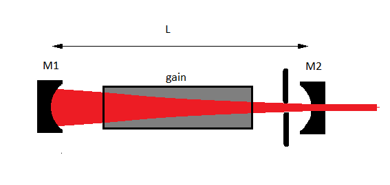

Examples.
=========

.. _interference:

Interference examples.
**********************

.. _Young:

.. Index::
    Two holes interferometer
    Young's interferometer
    BeamMix
    Fresnel
    CircAperture
    Begin
    Intensity

Young's experiment.
-------------------

.. plot:: ./Examples/Interference/Young.py
   :include-source:

.. _Michelson:

Michelson interferometer.
-------------------------

.. Index::
    Michelson
    interferometer
    GaussHermite
    Lens
    IntAttenuator
    Tilt
    BeamMix
    Forvard
    Begin
    Intensity

.. plot:: ./Examples/Interference/Michelson.py
   :include-source:

.. _diffraction:

Diffraction examples.
*********************

.. _circ_aperture:

.. Index::
    Forvard
    CircAperture
    Begin
    Intensity
    Fresnel diffraction

Diffraction from a circular aperture.
-------------------------------------

.. plot:: ./Examples/Diffraction/RoundHole.py
   :include-source:

.. _Poisson:

.. Index::
    Poisson spot
    Arago spot
    Diffraction
    Forvard
    CircScreen
    Begin
    Intensity

Spot of Poisson.
----------------

.. plot:: ./Examples/Diffraction/Poisson.py
   :include-source:

.. _BesselBeam:

Non-diffractive Bessel beam.
****************************

.. Index::
     Bessel beam
     Poisson spot
     Arago spot
     Annular slit
     Axicon
     CircularScreen
     CircularAperture
     Begin
     Forvard
     Fresnel
     Intensity
     
A Bessel beam has the interesting property that it does not diffract and that it keeps its shape
over large distances. Several meters, depending on parameters, can be realized. Applications of Bessel beams
take advantage of the very large size of the focus, which cannot be obtained using lenses or mirrors.
For example generation of a long narrow plasma channel can be realized using a high-power
laser beam converted into a Bessel beam by an axicon lens.
 
Besides an axicon, a combination of an annular slit and a positive lens or concave mirror can be used in staed.
In the following example a Poisson spot is generated by illuminating a circular disk by a plane mono-chromatic beam.
The disk is positioned in the primary focus of a positive lens so that the waves originating from the edge of teh disk will be collimated.
By blocking the rest of the incoming beam only the edge waves remain which results in a 
non-diffracting Bessel beam.

reference: J.Durnin, "Exact solutions for nondiffracting beams. I. The scalar theory."
JOSA A, Vol. 4, Issue 4, pp. 651-654 (1987)

From Poisson spot to a non-diffractive Bessel beam.
---------------------------------------------------

The waves originating from Huygens point-sources at the edge of the disk can be considered as a
collection of spherical waves which are all in phase because the disk is illuminated by a monochromatic plane wave.
Each spherical wave has the same amplitude as well. As a result these waves interfere constructively 
to a Poisson spot near the axis. It can be shown that the intensity distribution is approximately given by:

:math:`I(r,z) \approx I_0 J_0 ^2 ( \frac{2 \pi  \alpha r}{ \lambda } )`

with:

:math:`\alpha = \frac{a}{r}` is the angle of the wavefront near the axis, 
:math:`2a` is the diameter of the disk

The width of the beam is given by:

:math:`w(z)=\frac{2.44}{ \pi } \frac{ \lambda z}{a}`

and is proportional to the distance, z.

.. plot:: ./Examples/BesselBeam/BesselAnnularSlit1.py
   :include-source:

Collimating the edge waves with a lens.
^^^^^^^^^^^^^^^^^^^^^^^^^^^^^^^^^^^^^^^

When the disk is placed in the primary focus of a postive lens,the spherical waves are collimated and 
the angle, :math:`\alpha` remains constant. As a result the beam does not diverge anymore. Ofcourse 
the light passing the disk at larger distances from the edge will be focussed as well by the lens and 
will disturb the Bessel beam. This light can easily been blocked with an extra aperture
surrounding the disk resulting in an annular slit. 

.. plot:: ./Examples/BesselBeam/BesselAnnularSlit2.py
   :include-source:

Generation of a Bessel beam with a lens and an annular slit.
------------------------------------------------------------

By positioning an aperture around the disk a non-difracting Bessel beam is generated over a distance given by
the 'overlap area'. From geometric optics this distance can be estimated by:

:math:`z_{max}=\frac{Df}{a}`, where :math:`D` and :math:`f` are the diameter and focallength of the lens respectively.

.. plot:: ./Examples/BesselBeam/BesselAnnularSlit3.py
   :include-source:

Generation of a Bessel beam with an axicon.
-------------------------------------------

Using an annular slit is of course not very efficient because most of the incoming (laser) beam is not used.
A much more efficient way to generate a Bessel beam is the use of an axicon. With such an element
in principle all the incoming light is converted.
Although all the light is converted most applications are only interacting with the central lobe of the beam, which only carries
a small fraction of the total beam power.

.. plot:: ./Examples/BesselBeam/BesselAxicon.py
   :include-source:

Laser examples.
***************

.. Index::
     laser
     unstable laser resonator
     Begin
     Forvard
     Gain
     Lens
     Intensity

Laser simulation, stable laser resonator.
-----------------------------------------

A typical laser consists of two (concave or convex) mirrors separated some distance and a gain medium mostly based on
stimulated emission. One (or both) of the mirrors is partly transmissive and when the 
mirrors are well aligned and the losses are below some maximum the radiation field inside the 
resonator will grow starting from noise by spontaneous emission as a function of the number of round trips. The laser intensity will be structured in 
a number of resonator modes depending on the wavelength, the curvatures of and the distance between the mirrors 
and especially the diameter of an intra-cavity aperture.

   Laser resonator with gain.

In the python script below a number of parameters can be adjusted which allows the study of several 
important features of a laser. In the movie we show Q-switching to generate short high intensity pulses 
by changing the reflectivity of the outcoupling mirror, operation on high-order transversal modes by opening 
the aperture, changing the resonator g-parameters to study the stability criterion, 
injection of a high-order Gauss-Hermite mode and the effect of thin wires inside the resonator.

.. raw:: html

    <iframe width="560" height="315" src="_static/laser.m4v" frameborder="0" allowfullscreen></iframe>

:download:`(Download source code) <./Examples/Laser/laser_simulation.py>`

.. literalinclude:: ./Examples/Laser/laser_simulation.py
    :caption: laser_simulation.py
    :name: laser-simulation

.. _Unstab:

Unstable laser resonator.
-------------------------

.. plot:: ./Examples/Laser/unstable_resonator.py
   :include-source:

.. _PhaseRecovery:

Phase recovery.
***************

.. Index::
     phase recovery
     Begin
     Forvard
     Interpol
     SubIntensity
     Phase
     PhaseUnwrap
     Intensity

Phase recovery using Gerchberg Saxton iteration.
------------------------------------------------

.. plot:: ./Examples/PhaseRecovery/PhaseRecovery.py
   :include-source:

Zernike aberration.
*******************

Any aberration in a circle can be decomposed over a sum of Zernike 
polynomials. The Zernike command accepts four arguments:
1. The radial order n  2. The 
azimuthal order m. 3. The radius, R 4. The 
amplitude of the aberration.

.. _zernike_polynomial:

.. Index::
    Zernike aberration
    Zernike
    Fresnel
    CircAperture
    Begin
    Intensity

.. plot:: ./Examples/Zernike/Zernike.py
   :include-source:

Radial shear interferometer.
----------------------------

.. plot:: ./Examples/Zernike/rad_shear.py
   :include-source:

