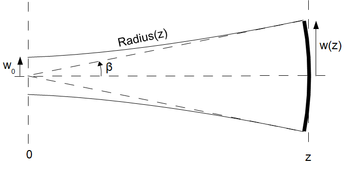

.. Index::
    Gauss beam
    Laser resonator
    Geometrical description of light
    rays
    ABCD propagation
    Stable resonator
    Confined rays

Gauss TEM\ :sub:`00` \ mode described with geometric optics.
************************************************************

June 2020, Fred van Goor.

Is it possible to describe a periodic focusing system such as a laser
resonator with geometric optics? The answer is of course no, because
there are no such things as amplitude, phase and wavelength when dealing
with rays. In stead we have to solve Maxwell’s equations leading to the
wave equation with boundary conditions. This equation can be solved
analytically in the paraxial approximation resulting in the well-known
Gauss-Hermite or Gauss-Laguerre resonator transverse- and longitudinal
resonator modes.

Yet, as will be shown in the following paragraphs, it has sense to find
the rays that can be confined in a stable resonator applying Snell’s law
for small angles. As will be shown, all the well-known formulas
describing the characteristic properties of the fundamental mode of an
empty, stable, open resonator can be deduced with ray-optics. The only
missing element in the formulation is the wavelength of the light
because this is not defined in geometric optics. We will introduce a wavelength to the theory by using
Heisenberg’s uncertainty relation or by comparison with the physical optics solution.

In what follows we will:

1) Use an ABCD matrix:
   :math:`\mathbf{M} = \begin{bmatrix} A & B \\ C & D \\ \end{bmatrix}`
   to decribe a resonator in the paraxial approximation.

2) Find the eigen-ray vectors and eigen values which can be used to
   describe rays in the resonator.

3) Find a collection of rays which are confined to the resonator.

4) Calculate second moments: i.e. average of the ray-positions; average
   of the ray-angles.

5) From the second moments the beam-propagation formulas will be derived
   as well as the brightness and M\ :sup:`2` \ value.

6) Using Heisenberg’s uncertainty principle we can estimate an arbritray
   constant which turns out to be dependent on the wavelength. By
   comparison with the physical optics solution we will find this
   constant as well.
   
All details about ABCD matrices, solving the wave equation, etc. can be found in for example: 
"Lasers" by: Anthony E. Siegman (1986).

ABCD matrix formulation to describe the propagation of rays.
============================================================

A ray vector can be defined as follows:
:math:`\mathbf{R} = \begin{bmatrix} {y} \\ \theta\\ \end{bmatrix}` 

where :math:`y` is the position of the ray above the optical axis and :math:`\theta` is the angle with that axis.
A period in a periodic system such as a laser resonator can be described
in the paraxial approximation (small angles :math:`\theta`) by the
1-pass propagation matrix:
:math:`\mathbf{M} = \begin{bmatrix} A & B \\ C & D \\ \end{bmatrix}`,
where :math:`A`, :math:`B`, :math:`C`, and :math:`D` are determined by
the details of the resonator, i.e. the radii of the mirrors and the
distance between the mirrors.

With an input ray,
:math:`\mathbf{R_0} = \begin{bmatrix} {y_0} \\ \theta_0\\ \end{bmatrix}`,
the output after one roundtrip is:
:math:`\mathbf{R_1} = \mathbf{M} \mathbf{ R_0}`

After the second roundtrip:
:math:`\mathbf{R_2} = \mathbf{M} \mathbf{ R_1}=\mathbf{M}^2 \mathbf{ R_0}`
and after :math:`n` roundtrips:
:math:`\mathbf{R_n} = \mathbf{M} \mathbf{ R_{n-1}}=\mathbf{M}^n \mathbf{ R_0}`.

Because of the principle of ‘ray reversibility’, the determinant of the
ABCD matrix is one:

.. math::

   Det\begin{bmatrix}
   A & B \\
   C & D \\
   \end{bmatrix} = AD-BC=1

Eigen values and eigen vectors (eigen rays)
===========================================

Each ray, :math:`R_0`, :math:`R_1`, :math:`R_2`, …. :math:`R_n` can be
written as a linear combination of the eigen rays, of the matrix
:math:`\mathbf{M}`:

.. math:: \mathbf{R}_n=\sum_xc_x\mathbf{R}{^e_x}

The eigen rays and eigen values can be found in the usual way by
solving:

.. math:: \mathbf{M}\mathbf{R}^e_x=\lambda_x\mathbf{R}^e_x

with :math:`\mathbf{R}^e_x` and :math:`\lambda_x` are the :math:`x^{th}`
eigen ray and eigen value respectively.

The solution is straightforward:

.. math::

    
   \begin{bmatrix}
   A & B \\
   C & D \\
   \end{bmatrix} \begin{bmatrix}
   {y_x} \\
   \theta_x\\
   \end{bmatrix} = \lambda_x
   \begin{bmatrix}
   {y_x} \\
   \theta_x\\
   \end{bmatrix}

or:

.. math::

   (A-\lambda_x)y_x=-B\theta_x\\
   (D-\lambda_x)\theta_x=-Cy_x\\

using :math:`AD-BC=1` we find the equation:

.. math::

   \lambda^2_x-(A+D)\lambda_x+1=0

with the solution of two eigen values:

.. math::

   \lambda_{a,b}=\frac{A+D}{2}\pm\sqrt{\Big(\frac{A+D}{2}\Big)^2-1}

defining :math:`m\equiv\frac{A+D}{2}` this can be written as:

.. math::

   \lambda_{a,b}=m\pm\sqrt{m^2-1}

The two eigen rays are found as follows:

.. math::

   \mathbf{R^e_a}=\begin{bmatrix}
   {y_a} \\
   \theta_a\\
   \end{bmatrix} = \begin{bmatrix}
   \frac{-B}{A-\lambda_a} \theta_a \\
   \theta_a\\
   \end{bmatrix}
   \\
   \mathbf{R^e_b}=\begin{bmatrix}
   {y_b} \\
   \theta_b\\
   \end{bmatrix} = \begin{bmatrix}
   \frac{-B}{A-\lambda_b} \theta_b \\
   \theta_b\\
   \end{bmatrix}

Taking :math:`\theta_{a,b}` equal to arbitrary, complex values:
:math:`\theta_{a,b}=\mu,\nu` the eigen rays can be written as:

.. math::

   \mathbf{R}^e_a=\mu\begin{bmatrix}
   \frac{-B}{A-\lambda_a}  \\
   1\\
   \end{bmatrix}
   \\
   \mathbf{R}^e_b=\nu\begin{bmatrix}
   \frac{-B}{A-\lambda_b}  \\
   1\\
   \end{bmatrix}

Collection of rays that can be confined to the resonator
========================================================

Each ray in the resonator can be described by a linear combination of
the two eigen rays:

.. math::

   \mathbf{R}_n=\mathbf{M}^n\mathbf{R}_0=\mathbf{M}^n(c_a\mathbf{R}^e_a+c_b\mathbf{R}^e_b)=c_a\lambda^n_a\mathbf{R}^e_a+c_b\lambda^n_b\mathbf{R}^e_b

where :math:`\mathbf{R}_0` is the input ray and :math:`\mathbf{R}_n` is
the ray after :math:`n` roundtrips. :math:`c_a` and :math:`c_b` are
unknown, complex constants.

We define:

.. math::

   c_a\mathbf{R}^e_a\equiv\frac{1}{2}(\mathbf{R}_0-i\mathbf{S}_0)
   \\
   c_b\mathbf{R}^e_b\equiv\frac{1}{2}(\mathbf{R}_0+i\mathbf{S}_0)

Two cases can be considered:

1) :math:`-1 \le m \le 1`: “Stable resonators”

   with :math:`\cos(\phi)\equiv m` it can be shown that:

   .. math::

       \mathbf{R}_n=\mathbf{R}_0\cos(n\phi)+\mathbf{S}_0\sin(n\phi)

2) :math:`|m| > 1`: “Unstable resonators”

with :math:`\cosh(\phi)\equiv m` it can be shown that:

.. math::

       \mathbf{R}_n=\mathbf{R}_0\cosh(n\phi)-i\mathbf{S}_0\sinh(n\phi)

There are two classes of unstable resonators:

:math:`m>1` : “positive branch”

:math:`m<-1`: “negative branch”

In what follows we will only consider case 1), stable resonators.

Of course the rays in the resonator must be real:

.. math::

   \Im(\mathbf{R}_n)=0

Because we only consider resonators with real
:math:`\begin{bmatrix} A & B \\ C & D \\ \end{bmatrix}` matrices, and
because :math:`\phi=\arccos(m)=\arccos(\frac{A+D}{2})`,
:math:`\cos(n\phi)` and :math:`\sin(n\phi)` are real.

Therefore we require:

.. math::

   \Im(\mathbf{R}_0)=\Im(\mathbf{S}_0)=0

It can be shown that:

.. math::

   \mathbf{R}_0=2c\begin{bmatrix}
   z_1\cos(\alpha)-z_R\sin(\alpha) \\
   \cos(\alpha)  \\
   \end{bmatrix}

and that:

.. math::

   \mathbf{S}_0=\frac{\partial \mathbf{R}_0}{\partial \alpha}=-2c\begin{bmatrix}
   z_1\sin(\alpha)+z_R\cos(\alpha) \\
   \sin(\alpha)  \\
   \end{bmatrix}

with:

.. math::

   z_1\equiv \frac{A-D}{2C}\\
   z_R\equiv \frac{\sqrt{1-m^2}}{C}

:math:`0\le \alpha \le 2\pi` and :math:`c` are arbitrary, real
parameters. They define a ray that is confined to and can propagate
through the resonator.

When dealing with “second moments” in the next paragraph we will see that
:math:`z_1` is the distance from the reference plane (input to
the\ :math:`\begin{bmatrix} A & B \\ C & D \\ \end{bmatrix}` system) to
the “beam waist” and that :math:`z_R` is equal to the “Rayleigh length”.

In the following Python script we calculate the propagation of a large number of rays in the resonator.

.. plot:: geometric_laser_plot_rays.py

Second moments
==============

The envelope of the bundle of rays and other parameters can be found
using **second moments**.

For the input rays:

.. math::

   \mathbf{R}_0=\begin{bmatrix}y_0 \\
   \theta_0\\
   \end{bmatrix}
   =2c\begin{bmatrix}
   z_1\cos(\alpha)-z_R\sin(\alpha) \\
   \cos(\alpha)  \\
   \end{bmatrix}\;0 \leq \alpha \leq 2\pi

we find for the second moment of :math:`y_0`:

.. math::

   \langle{y_0^2}\rangle=\frac{1}{2\pi}\int_0^{2\pi}y_0(\alpha)^2\mathrm{d}\alpha=\frac{4c^2}{2\pi}\int_0^{2\pi}(z_1\cos\alpha-z_R\sin\alpha)^2\mathrm{d}\alpha=

.. math::

   =\frac{4c^2}{2\pi}\left[z_1^2\int_0^{2\pi}\cos^2\alpha\mathrm{d}\alpha+z_R^2\int_0^{2\pi}\sin^2\alpha\mathrm{d}\alpha-2z_1z_R\int_0^{2\pi}\sin\alpha\cos\alpha\mathrm{d}\alpha\right]=

.. math::

   =\frac{4c^2}{2\pi}\left[\pi{z_1^2}+\pi{z_R^2}+0\right]=2c^2\left(z_1^2+z_R^2\right)

In a similar way we find for the second moments of :math:`\theta_0` and
:math:`y_0\theta_0`:

.. math::

   \langle{\theta_0^2}\rangle=\frac{1}{2\pi}\int_0^{2\pi}\theta_0(\alpha)^2\mathrm{d}\alpha=2c^2

.. math::

   \langle{y_0\theta_0}\rangle=\frac{1}{2\pi}\int_0^{2\pi}{y_0}(\alpha)\theta_0(\alpha)\mathrm{d}\alpha=2c^2z_1

In general we want to know the rays at a distance :math:`z'` from the
input-reference plane:

.. figure:: _static/geometric_laser_fig1.png

In other words we want to know :math:`\mathbf{R}(z',\alpha)` for a given
input ray :math:`\mathbf{R}_0=\mathbf{R}(0,\alpha)` The ray at a
distance :math:`z'` can be found by propagating in free space
(refractive index = 1):

.. math::

   \mathbf{R}(z',\alpha)=\begin{bmatrix}
   1 & z' \\
   0 & 1 \\
   \end{bmatrix}\mathbf{R}_0=
   \begin{bmatrix}
   y_0 + z'\theta_0 \\
   \theta_0 \\
   \end{bmatrix}=
   2c\begin{bmatrix}
   z_1\cos{\alpha}-z_R\sin{\alpha}+z'\theta_0 \\
   \theta_0 \\
   \end{bmatrix}

Using :math:`\theta_0=\cos{\alpha}` and :math:`z \equiv{z_1+z'}` we find
for the rays at a distance, :math:`z`, from the beam waist (at a
distance :math:`z_1` from the reference plane):

.. math::

   \mathbf{R}(z,\alpha)=2c\begin{bmatrix}
   z\cos{\alpha}-z_R\sin{\alpha} \\
   \cos{\alpha} \\
   \end{bmatrix}

The second moments at :math:`z` are now:

.. math::

   \langle{y(z)^2}\rangle=2c^2(z^2+z_R^2)\equiv{w(z)^2}\\
   \langle\theta(z)^2\rangle=2c^2\\
   \langle{y(z)}\theta(z)\rangle=2c^2z

With :math:`w_0\equiv{w(0)}=\sqrt{2}cz_R` we define the beam waist
:math:`w_0` at :math:`z=0`. The size of the beam at a distance,
:math:`z`, from the waist is:

.. math::

   w(z)^2=2c^2z_R^2\left(1+\frac{z^2}{z_R^2}\right)

or:

.. math::

   w(z)^2=w_0^2\left(1+\frac{z^2}{z_R^2}\right)

This formula of the size of the beam (bundle of confined rays) is
exactly the same as the formula of the beam size of a Gaussian beam
modelled according to the theory of physical optics, based on Maxwell’s
equations. Also, the beam-area doubles when propagating a distance,
:math:`z_R`, from the waist:

.. math::

   w(z_R)^2=2c^2z_R^2(1+1)=2w_0^2

according to the definition of the Rayleigh length. The beam size,
:math:`w(z)`, is also plotted in the figure below executing the same Python script as before but now with the second moments included (black dashed curves). 

.. plot:: geometric_laser_plot_rays2.py

Wavefront radius
================

The radius of the wavefront can be found as follows: From
the figure it follows that:

.. math:: \beta=\frac{dw(z)}{dz}=\frac{w(z)}{Radius(z)}

.. math:: \frac{dw(z)^2}{dz}=2w\frac{dw}{dz}=2w(z)\frac{w(z)}{Radius(z)}=2\frac{\langle{y(z)^2}\rangle}{Radius(z)}

Also:

.. math::

   \frac{d{w(z)^2}}{dz}=\frac{d}{dz}[2c^2(z^2+z_R^2)]=4c^2z=2\langle{y(z)}\theta(z)\rangle

So, we find for the radius of the wavefront at large values of z:

.. math::

   Radius(z)=\frac{\langle{y(z)^2}\rangle}{\langle{y(z)\theta(z)}\rangle}=\frac{w_0^2(1+\frac{z^2}{z_R^2})}{2c^2z}
   =\frac{2c^2(z^2+z_R^2)}{2c^2z}=z(1+\frac{z_R^2}{z^2})

Brightness
==========

The following parameter, called the **Brightness** of the beam, does not
change while propagating the beam:

.. math::

   Brightness\equiv\sqrt{\langle{y(z)^2}\rangle\langle\theta{(z)^2}\rangle-\langle{y(z)}\theta(z)\rangle^2}
   =\sqrt{4c^4(z^2+z_R^2-z^2)}=2c^2z_R=const

Get the constant :math:`c`
==========================

The constant :math:`c` is still unknown and can be obtained by using
Heisenberg’s uncertainty relation or by comparing the results with the
formulas obtained using physical optics, the solution of the wave
equation.

**a) Heisenberg:**

The angle, :math:`\beta`, is given by:

.. math::

   \beta= \frac{w(z)}{z}\mid_{z\rightarrow\infty}=\frac{w_0\frac{z}{z_R}}{z}=\frac{w_0}{z_R}

The Heisenberg relation for the uncertainty of the impulse and position
in the transverse direction, :math:`y`, of a photon is given by:

.. math::

   \Delta{P_y}\Delta{y}=h

Assume that the uncertainty of the impulse,
:math:`p_z=\frac{h}{\lambda}`, :math:`\Delta{p_z}` in the z direction is
zero, the angle, :math:`\beta` is also given by:

.. math::

   2\beta=\frac{\Delta{p_y}}{p_z}=\frac{\frac{h}{2w_0}}   {\frac{h}{\lambda}}=\frac{\lambda}{2w_0}

So, from:

.. math::

   2\beta=\frac{2w_0}{z_R}=\frac{\lambda}{2w_0}

it follows that:

.. math::

   4w_0^2=\lambda{z_R}
   8c^2z_R^2=\lambda{z_R}

The constant, :math:`c` is:

.. math::

   c=\frac{\lambda}{4\sqrt{2}w_0}

**b) Compare with physical optics solution:**

For a round beam the Rayleigh length is:

.. math::

   z_R=\frac{\pi{w_0^2}}{\lambda}

using :math:`z_R=\frac{w_0}{\sqrt{2}c}` we find for the constant
:math:`c`:

.. math::

   c=\frac{\lambda}{\pi{\sqrt{2}w_0}}

(There is a slight difference with the Heisenberg method. Maybe this is
due to the slab geometry versus cylinder geometry? Comments are welcome!)

